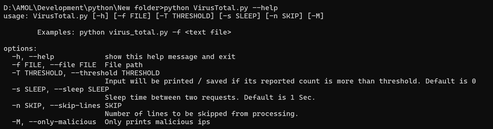
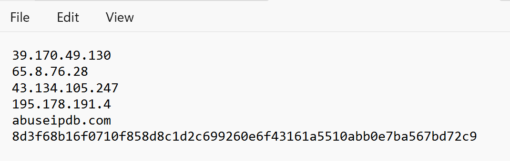
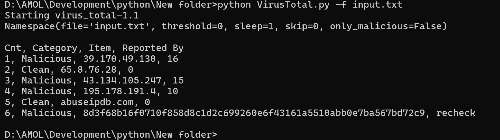

# Bulk Reputation Checker

## About:
- This script was developed with intention to reduce the time required to **validate large number of IPs, Domains, Hash values on VirusTotal**.
- You **do not need API keys** to use this script. But, after few tens of requests you will get a CAPTHA to solve. After solving the CAPTCHA script will run smoothly until it faces rate limiting issue.
- This tool supports more than **20-30 requests / minute** (Much more than supported by free APIs). You can adjust the sleep time between two requests if you face rate limiting issues.
- The output is not redirected to file because there can be rate limiting errors from VirusTotal after 200 - 300 requests.
- The output is printed on the terminal in csv format.

### Note
- If you get an rate limiting error multiple times then, avoid using the script for 1 or 2 hours. You can try executing the script from different IP. 

### Usage

*Help Menu*

*Input FIle*

*Script in Action*

### Donate a Coffee

